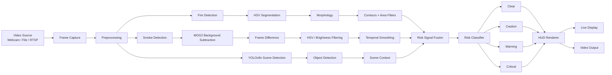
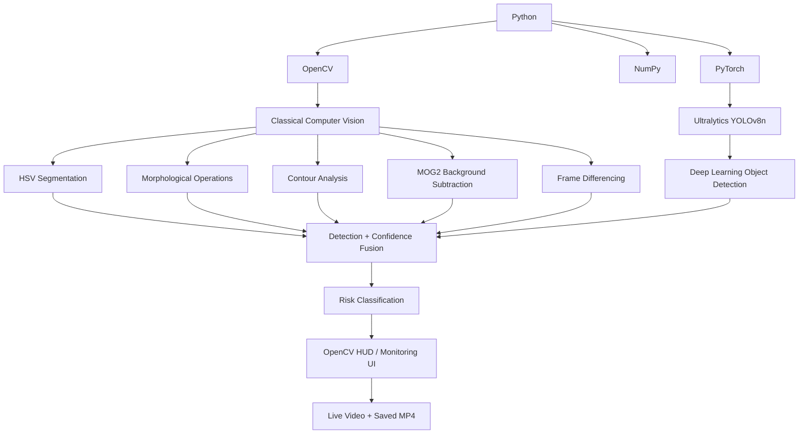

# 🏗️ System Architecture & Interview Revision Map

This is the **one-page technical map** for the project. Use it before an interview to quickly reconstruct how data moves through the system.

## 1. End-to-End Architecture



## 2. Technology Flowchart



## 3. File → Responsibility Map

| File | Interview revision focus |
|---|---|
| `app.py` | Main pipeline, detectors, risk logic, HUD and CLI |
| `yolov8n.pt` | YOLOv8n pretrained model weights |
| `requirements.txt` | Python dependencies |
| `README.md` | Project overview, setup, controls and concepts |
| `ARCHITECTURE.md` | Architecture, technology flow and revision notes |

## 4. Code-Level Mental Model

```text
INPUT
  ↓
Capture frame
  ↓
Preprocess
  ├── FireDetector
  │     └── HSV → morphology → contours → confidence
  │
  ├── SmokeDetector
  │     └── MOG2 → frame difference → HSV → smoothing → confidence
  │
  └── SceneDetector
        └── YOLOv8n → objects / scene context
  ↓
Combine signals
  ↓
Risk classification
  ↓
HUD rendering
  ↓
Display / video output
```

## 5. Interview Explanation: 60 Seconds

**Problem:** Detect visual signs of fire and smoke from video in real time.

**Approach:** Each frame is processed by separate detection stages. Fire uses HSV color segmentation, morphology and contour analysis. Smoke combines motion/background subtraction with color and brightness cues. YOLOv8n adds object-level scene context.

**Decision layer:** Detection signals are smoothed and combined into a risk level: CLEAR, CAUTION, WARNING or CRITICAL.

**Output:** The result is rendered as a live monitoring HUD and can also be written to an output video.

**Key engineering idea:** Classical CV provides lightweight visual signals, while YOLO provides learned object context. Those signals remain separate until the risk layer.

## 6. Key Concepts to Revise

### Computer Vision
- RGB vs HSV
- Thresholding and masks
- Morphological operations
- Contours and connected regions
- Background subtraction
- Frame differencing
- Temporal smoothing

### Deep Learning
- YOLO architecture
- Object detection
- Bounding boxes
- Confidence scores
- IoU and NMS
- CPU vs CUDA inference
- FP16 inference

### Software Engineering
- Classes and separation of responsibilities
- Configuration
- CLI arguments
- Video I/O
- FPS/performance measurement
- Error handling

## 7. Production Evolution

```text
Current prototype
      ↓
Custom fire/smoke dataset
      ↓
Train + validate
      ↓
Precision / Recall / mAP
      ↓
Object tracking
      ↓
FastAPI inference service
      ↓
PostgreSQL event logging
      ↓
Docker
      ↓
Cloud deployment
```

> **Interview anchor:** Input → Preprocess → Detect → Fuse → Classify → Render → Output.
