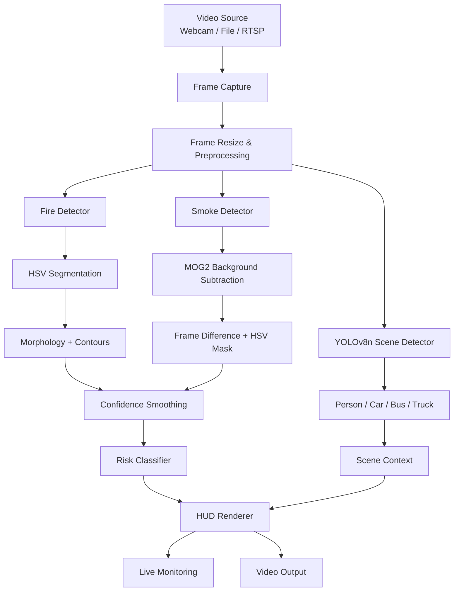

# System Architecture

## Components

| Component | Responsibility |
|---|---|
| Frame Capture | Reads webcam, file, or stream input |
| Fire Detector | Finds fire-like colour/brightness regions |
| Smoke Detector | Combines motion and grey/white-region cues |
| YOLOv8n | Adds scene-object context |
| Confidence Smoothing | Reduces frame-to-frame instability |
| Risk Classifier | Maps signals to CLEAR/CAUTION/WARNING/CRITICAL |
| HUD Renderer | Produces the monitoring interface |
| Video Writer | Saves processed output |
