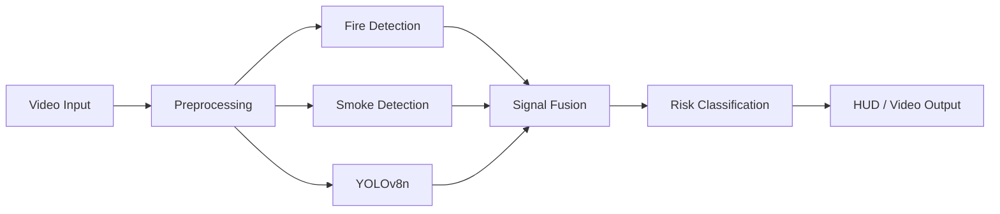
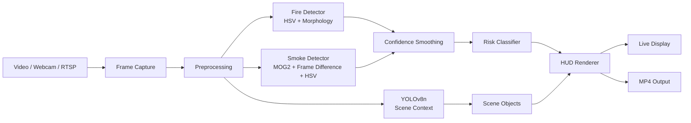

# 🔥 Industrial Fire & Smoke Detection

> Real-time computer vision pipeline for fire, smoke, and scene-context detection from video.

## 🎯 Project at a glance

```text
Video → Preprocess → Fire + Smoke + YOLO → Signal Fusion → Risk → HUD → Output
```

This project combines classical computer vision with YOLOv8n deep-learning inference to create a real-time monitoring pipeline.

## 🏗️ Architecture

See [ARCHITECTURE.md](./ARCHITECTURE.md) for the full architecture diagram, technology flowchart, file responsibility map, 60-second interview explanation, and revision checklist.

### High-level flow




> Real-time computer vision for detecting fire, smoke, and scene context from video.

## Overview

This project combines **classical computer vision** with **YOLOv8n** to build a real-time hazard-monitoring pipeline.

The system processes video frames through independent detection stages, combines their confidence signals, classifies overall risk, and renders a live monitoring HUD.

## 🧠 Architecture



## ✨ Detection pipeline

### Fire detection
HSV colour segmentation, morphological cleanup, contour filtering, and brightness checks identify fire-like regions.

### Smoke detection
Combines MOG2 background subtraction, frame differencing, low-saturation/brightness filtering, morphology, and temporal confidence smoothing.

### Scene context
YOLOv8n identifies selected scene objects such as people and vehicles.

### Risk classification

| Level | Meaning |
|---|---|
| 🟢 CLEAR | No significant hazard signal |
| 🟡 CAUTION | Early signal |
| 🟠 WARNING | Elevated signal |
| 🔴 CRITICAL | Strong hazard signal |

> This is a computer-vision demonstration, not a certified fire-safety system.

## 📁 Project structure

```text
industrial-fire-smoke-detection/
├── app.py                 # Main application and pipeline
├── yolov8n.pt             # YOLOv8n model weights
├── requirements.txt       # Python dependencies
├── README.md              # Project documentation
├── outputs/               # Generated detection videos
└── screenshots/           # Captured demo frames
```

## ⚙️ Requirements

- Python 3.10+
- OpenCV
- NumPy
- PyTorch
- Torchvision
- Ultralytics
- Pillow

## 🚀 Run

```bash
python app.py
```

Use a video file:

```bash
python app.py path/to/video.mp4
```

Disable YOLO scene detection:

```bash
python app.py --no-yolo
```

The application also accepts a webcam index or stream URL.

## 🎮 Controls

| Key | Action |
|---|---|
| Q | Quit |
| P | Pause / resume |
| S | Save screenshot |

## 🧩 Engineering concepts

**Computer Vision:** HSV segmentation • morphology • contours • frame differencing • background subtraction

**Deep Learning:** YOLOv8 inference • GPU/CPU selection • FP16 inference

**Software Engineering:** configuration • classes • CLI arguments • video I/O • performance telemetry • modular detection stages

## 🔭 Next improvements

- Custom fire/smoke training dataset
- Quantitative evaluation with precision, recall and mAP
- Object tracking
- Event logging
- FastAPI inference service
- Database-backed alerts
- Docker deployment
- Production monitoring

## 👨‍💻 Portfolio context

This project is part of my progression from **Python and computer vision fundamentals toward production AI systems, backend engineering, and system design**.

**Stack:** `Python` `OpenCV` `PyTorch` `YOLOv8` `NumPy`

---

**Build → Understand → Measure → Improve → Deploy**
